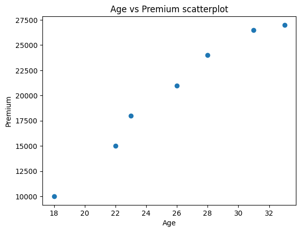

# Simple-Linear-Regression
Implement <b>Simple Linear Regression</b> to predict insurance premium based on age.
This is a simple dataset of 7 rows, with only two columns, one as dependent variable and the other as independent variable.
 
We use the age as the independent variable and predict insurance which is the dependent variable.
 
The first after loading the dataset into a dataframe is to check for its info a - This gives a snapshot of the column's datatype and missing values. 
  1) There are no null values
  2) The datatype of both age and Premium is integer.
  3) There are 7 data rows and 2 columns.
 

Then we check the overall data distribution using describe - 
  1) Age ranges between 18 to 33 with average age being 25
  2) Insurance ranges from 10000 to 27000 with the average being 20,214.
 
Next, we assign age to a variable X and premium to variable Y and draw a scatterplot.
 

 

The variables are reshaped and then split into train and test datasets in 70:30 ratio. This is <b>Model Training</b>. This is a small dataset used only to demonstrate the usage of SLR. However, real world datasets are humongous.
 

We fit the <b>Linear Regression</b> model using X_train and Y_train data. This means we teach the algorithm to learn for the X_train (age) values provided, the Y_train (premium) is the definite output.
 

The model next is given X_test(age) data and is asked to predict the premium based on what it learnt. This is stored in y_pred.
 

To idenitfy how well our model predicts is evaluated through the comparison of the difference between y_pred (predicted data) and the Y_test (the real data). If the difference is small, the the model is relatively good without bringing in the concept of overfitting, data leakage etc. If the difference is huge, then the model needs to retrained differently or a different model needs to be explored as the prediction is far from its real value.
 

 

 

The model we developed can be considered good. We have used RMSE(Root mean squared error) and R^2 (R square) as the evaluation metrics.
 

The <b>RMSE value is : 850.6447</b> -  The lower the value the better/stable the model's prediction is. This means our predicted value lies between +/-850. 
 

RMSE explains the deviation of the residuals from its true value. In this example if our model predicts the insurance for a given age is 12000, then the true value lies between 11150 to 12850 which in real world is a decent prediction giving a ballpark estimate.
 

The <b>R2 Score is : 0.9695</b>. The higher the better. The valoe of R^2 lies between 0 and 1. It is the coefficient of determination. Since the value 0.96 is closer to 1, this model is a good fit for the data provided.

